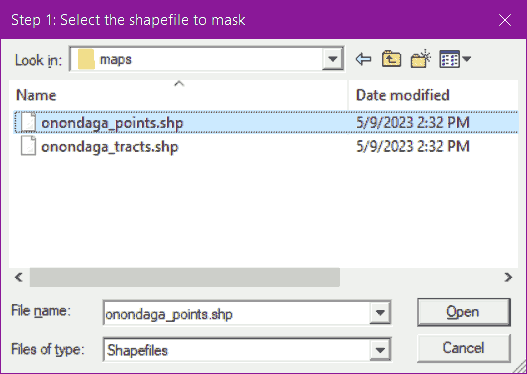
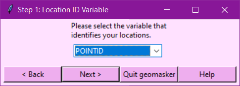
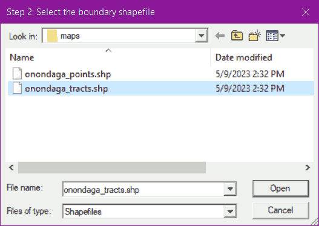
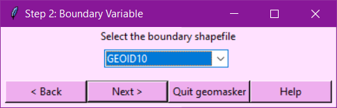
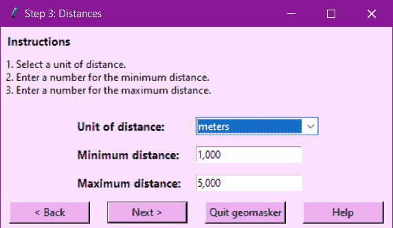
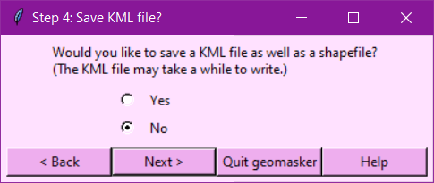
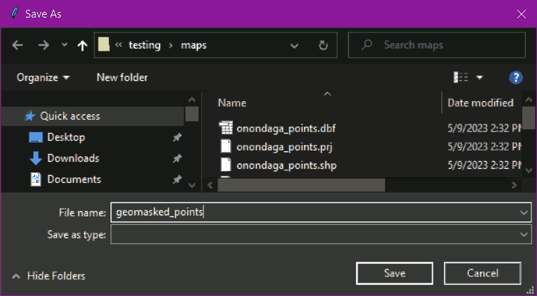
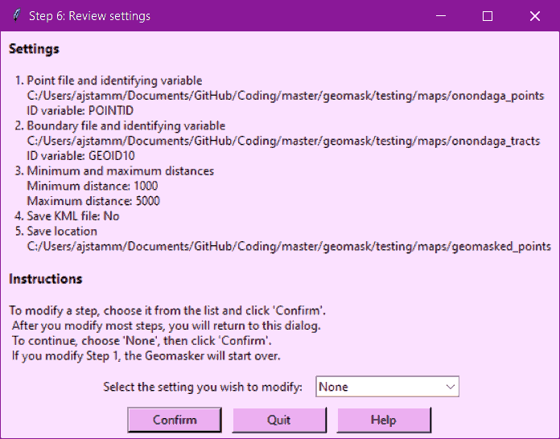
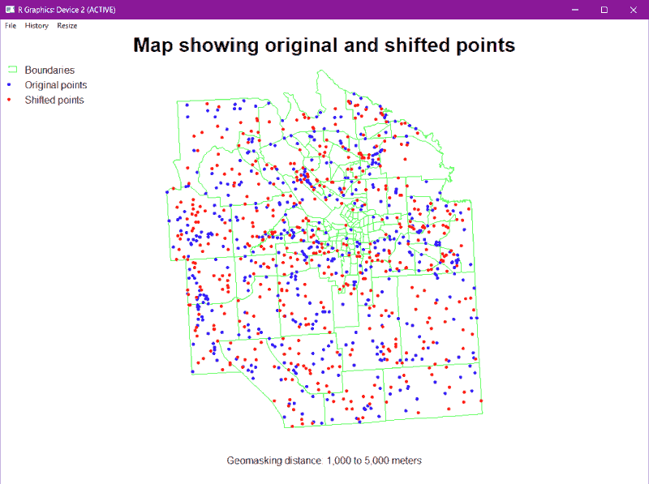

```{r, include = FALSE}
knitr::opts_chunk$set(eval = TRUE, echo = FALSE,
  collapse = TRUE,
  comment = "#>"
)
```

# Introduction

This vignette is designed for a user with no experience in R who just wants to run the default version of the NYS Geomasking Tool, or geomasker. This manual breaks down the different parts of the program and describes what to do and what to expect using 2010 Census shapefiles for Onondaga County in New York State, which are embedded in the package. These shapefiles will be used in this manual. 

*Note: For users who wish to modify the geomasker, developer options have been written into several of the package functions. Check the functions' help pages (linked from function names) and the [Technical Notes](../doc/tech_notes.html) for more information. Users interested only in running the geomasker can ignore these links.*

# Objective

This tutorial will walk you through the following activities. You will start with a shapefile of landmark points in Onondaga County, NY. You will enter settings to shift these points within their Census tracts.

The results will be displayed in the log and as a map in a PDF. The new points will be saved as an ESRI shapefile and, if desired, as a Google Earth KML file so that you can import them to your preferred GIS application.


# Running the geomasker

Please note that R is case sensitive. The provided code is designed to be copy-pasted, but if you prefer to type it yourself, be aware of capitalization.

To follow this vignette, you will need appropriate shapefiles. For that purpose, the first step is to create the shapefiles using the R package `tigris`. The `tigris` package is not required to run the geomasker, so you may need to install it first.

```{r installtigris, eval = FALSE, echo = TRUE}
# install tigris if necessary
install.packages("tigris")
```

The code below will save two shapefiles to your working directory. To find your working directory, run `getwd()`. To change your working directory, run `setwd(your_filepath)` with the folder you want. R does recognize relative path commands like `../`.

```{r createshapefiles, eval = FALSE, echo = TRUE, warning = FALSE, message = FALSE}
# create and save the shapefiles
onon_tracts <- tigris::tracts("NY", "Onondaga", year = 2010) |>
  dplyr::select(GEOID10)
ny_points <- tigris::landmarks("NY", "point", year = 2015) |> 
  dplyr::select(ANSICODE, POINTID, FULLNAME, MTFCC)
points_in_tracts <- sf::st_contains(onon_tracts, ny_points) |> unlist()
onon_points <- ny_points[points_in_tracts, ]

sf::write_sf(onon_tracts, dsn = "maps", layer = "onondaga_tracts", 
             driver = "ESRI shapefile")
sf::write_sf(onon_points, dsn = "maps", layer = "onondaga_points", 
             driver = "ESRI shapefile")

rm(onon_points, ny_points, onon_tracts, points_in_tracts)
```


To run the geomasker, you only need one line of code:

```{r rungm, eval = FALSE, echo = TRUE, warning = FALSE, message = FALSE}
geomask::runGMprogram()
```

The steps below will walk you through the dialogs and describe the types of input expected using the shapefiles created above. 

The geomasker starts by creating initial variables and displaying a progress bar that will continually update as it runs. Its processes occur in this order:

* request information in 7 user input steps
* Shift or mask the locations
* draw a map
* save files

# User input section

This is the interactive portion of the geomasker. The steps below will walk you through what to expect from the geomasker. If any portion of this section is cancelled, the geomasker will quit. 

Do not close the progress bar before the geomasker finishes running. If you do, the geomasker will crash with this error:

> warning('Error in structure(.External(.C_dotTclObjv, objv), class = "tclObj") :  
>   [tcl] bad window path name ".113".')

## Step 1. Request an input shapefile

This step requests the location shapefile and identifier variable from the user using pop-up dialogs. In the first dialog, you can navigate to any shapefile on your computer or network. To follow the steps as shown, navigate to the "maps" folder you just created. Select the "onondaga_points" shapefile. 

```{r shppic, fig.cap = 'Dialog: Identify Location Shapefile', fig.alt = 'Dialog: Identify Location Shapefile', echo = FALSE}
# generate window for image
# uses gatpkg::locateGATshapefile()

```

To follow the steps as shown, select "onondaga_points.shp" and click "Open" to move to the next step or "Cancel" to end the program. 

In the second dialog, all variables in the locations shapefile with unique (non-repeated) values are listed. Select the variable you wish to use for your identifier.

```{r locidpic, fig.cap = 'Dialog: Identify location ID variable', fig.alt = 'Dialog: Identify Location ID', echo = FALSE}
# generate window for image
# uses gatpkg::locateGATshapefile()

```

To follow the steps as shown, select "POINTID". Click "Next >" to move to the next step, "< Back" to move to the previous step, "Quit geomasker" to end the program, or "Help" to get further guidance.


## Step 2. Request boundary shapefile

This step requests the boundary shapefile and identifier variable from the user using pop-up dialogs. In the first dialog, you can navigate to any shapefile on your computer or network. To follow the steps as shown, navigate to the "maps" folder you just created. Select the "onondaga_tracts" shapefile. 

```{r boundpic, fig.cap = 'Dialog: Identify Boundary Shapefile', fig.alt = 'Dialog: Identify Boundary Shapefile', echo = FALSE}
# generate window for image
# uses gatpkg::locateGATshapefile()

```


To follow the steps as shown, select "onondaga_tracts.shp" and click "Open" to move to the next step or click "Cancel" to end the program. 

In the second dialog, all variables in the boundary shapefile with unique (non-repeated) values are listed. Select the variable you wish to use for your identifier.

```{r boundidpic, fig.cap = 'Dialog: Identify boundary ID variable', fig.alt = 'Dialog: Identify Boundary ID', echo = FALSE}
# generate window for image
# uses gatpkg::locateGATshapefile()

```

To follow the steps as shown, select "GEOID10". Click "Next >" to move to the next step, "< Back" to move to the previous step, "Quit geomasker" to end the program, or "Help" to get further guidance.


## Step 3. Request distances

This step requests the desired minimum and maximum values and their unit of measure from the user using a pop-up dialog. In this dialog, select the unit of measure for the distance from the drop-down menu. Enter the minimum and maximum distances you would like the masked point to be moved.


```{r distpick, fig.cap = 'Dialog: Select Distances', fig.alt = 'Dialog: Select Distances', echo = FALSE}
# generate window for image
# geomask::selectGMdistance(step = 3, min = 100, max = 500, unit = "",
#                           quitopt = "Quit geomasker")

```

To follow the steps as shown, select "meters" for unit of distance, change the minimum value to "1,000", and change the maximum value to "5,000". Click "Next >" to move to the next step, "< Back" to move to the previous step, "Quit geomasker" to end the program, or "Help" to get further guidance.


## Step 4. Request whether to save KML file

This step asks whether the user wants to save a KML file using a pop-up dialog.

```{r kmlpic, fig.cap = 'Dialog: Save KML', fig.alt = 'Dialog: Save KML', echo = FALSE}
# generate window for image
# gatpkg::saveGATkml(step = 9)

```

To follow the steps as shown, select "No". Click "Next >" to move to the next step, "< Back" to move to the previous step, "Quit geomasker" to end the program, or "Help" to get further guidance.

## Step 5. Request where to save shapefile

This step asks the user where to save the shapefile using a pop-up dialog. In this dialog, you can navigate to any folder on your computer or network. 

```{r savepic, fig.cap = 'Dialog: Save File', fig.alt = 'Dialog: Save File', echo = FALSE}
# generate window for image
# gatpkg::saveGATfiles()

```

To follow the steps as shown, navigate to your documents folder. Enter "geomasked_points". Click "Save" to move to the next step or click "Cancel" to end the program. 


## Step 6. Request settings confirmation


This step requests confirmation of all settings from the user using a pop-up dialog. In this dialog, you can select a step to modify or move on. To modify steps, select the first step you want to modify from top to bottom. After each modification, you will return to this dialog to select the next step. 

```{r confirmpic, fig.cap = 'Dialog: Confirm Settings', fig.alt = 'Dialog: Confirm Settings', echo = FALSE}

```

If you choose to change something, select the relevant item from the drop-down menu. Click "Confirm" to begin geomasking, "Quit" to end the program, or "Help" to get further guidance. To follow the steps as shown, select "None" and click "Confirm".


# Shapefile processing section

At this point, if the user has not cancelled the program, the shapefile processing begins.


## Step 7: Calculate masked points

This is the only step in this section. This portion of the program is found in the function [`calculateGMpoints()`](../man/calculateGMpoints.html). Because this step can take a while, a separate progress bar tracks its progress.

Buffers are drawn around each point and rings are created by subtracting the inner buffer (radius = minimum value) from the outer buffer (radius = maximum value). These buffers are intersected with the boundary file. Only the portion of each ring that intersects with its location's corresponding tract is kept. The masked point is selected randomly from the masked area. 

# Mapping section

This section contains the map created by the program. 

## Step 8. Map comparison of old and new locations


This map is a comparison of the original and geomasked locations. In this map, the original and shifted points are overlaid on top of the boundary map so you can see how the locations shifted. This portion of the program is found in the function [`plotGMcompare()`](../man/plotGMcompare.html). 

```{r mapca, fig.show = "hold", fig.cap = 'Map: Compare original and shifted locations', echo = FALSE}

```

*Note:* R package documentation allows you to view images, but not link to them. For the map, view a larger image by right clicking on the map and selecting "Open image in new tab." 

# File saving section

This section contains the file saving steps. 

## Step 9. Save map and settings

In this section, the map is saved to a PDF file in the same folder as the aggregated shapefile. The same save filename is used with "map" at the end.

An Rdata file is also saved. The same save filename is used with "settings" at the end. This file includes all settings in R format, which can be opened in R or run through the geomasker a second time. If you want to use the Rdata file to re-run the geomasker, use this code and change `myfilepath` to the location and name of your Rdata file:

```{r savesettings, eval=FALSE, echo = TRUE}
myfilepath <- "c:/users/my_id/my_folder/geomasked_points_settings.Rdata"
geomask::runGMprogram(settings = myfilepath)
```

Files saved to the save folder if you followed the vignette:

- geomasked_points_map.pdf
- geomasked_points_settings.Rdata


## Step 10. Save shapefiles

The original shapefile is resaved with the new filename and the tag "old" at the end. This file contains all the same variables as the new file, but is mapped to the original locations. The shapefile with the tag "new" is the same as the "old" shapefile, but maps to the new locations. The shapefile with the tag "buffer" contains the buffer areas from which the masked points were sampled. The only variables it contains are point_id (the location ID) and bound_id (the boundary ID). This shapefile is included in case it is useful for assessing the geomasking process.

Files saved to the save folder if you followed the vignette:

- geomasked_points_old.dbf  
- geomasked_points_old.prj  
- geomasked_points_old.shp  
- geomasked_points_old.shx  
- geomasked_points_new.dbf  
- geomasked_points_new.prj  
- geomasked_points_new.shp  
- geomasked_points_new.shx  
- geomasked_points_buffer.dbf  
- geomasked_points_buffer.prj  
- geomasked_points_buffer.shp  
- geomasked_points_buffer.shx  

The "flag" variable in the old and new buffers refers to the number of times boundaries had to be recalculated to create a valid area to select a masking point. Each time the buffering failed to create a valid area, the maximum and minimum values were recalculated as follows.

- new maximum value = prior minimum value, or given the flag value, $$new_-min = \frac{old_-min}{2^{flag}}$$
- new minimum value = half of prior minimum value, or given the flag value, $$new_-max = new_-min * 2$$


> For example, given the original minimim value of 1000, 
> 
>   * A flag value of 0 means the original buffer area was valid. 
>   * A flag of 2 means the buffer had to be recalculated twice to create a valid area, so the new minimum value equals 250 and new maximum value equals 500.


To map the first five records in these files yourself after the geomasker finishes, you can use the following code. The first part reads in the shapefiles. The second part draws the map.

```{r drawmap, eval = FALSE}
# read your shapefiles
myfilepath <- "c:/users/my_id/my_folder" # wherever you saved the files
old <- sf::read_sf(dsn = myfilepath, layer = "geomasked_points_old")
new <- sf::read_sf(dsn = myfilepath, layer = "geomasked_points_new")
buffer <- sf::read_sf(dsn = myfilepath, layer = "geomasked_points_buffer")
# draw your map
plot(sf::st_geometry(buffer[1:5,]), border = "green", col = rgb(0, 1, 0, .05))
plot(sf::st_geometry(old[1:5,]), add = TRUE, pch = 20, col = "blue")
plot(sf::st_geometry(new[1:5,]), add = TRUE, pch = 20, col = "red")
```

## Step 11. Save KML file

In this step, nothing happens if you are following the vignette and selected "No" when asked if you wanted to save a KML file. If you had selected "Yes", a KML file and a KMZ (zipped KML) file would have been created in this step that could then be opened in Google Earth. 

Files saved to the save folder if "Yes" was selected in Step 9:

- geomasked_points.kml 
- geomasked_points.kmz 


## Step 12. Save log

In this step, a text file is saved that includes all of your settings and some details about the geomasking variables. 


File saved to the save folder if you followed the vignette:

- geomasked_points.log


# Geomasker finished, now what?

## Where to find your files

All files are saved to the save folder you selected. The log file contains a partial list of files created. The R console will display a full list of all files created and their location when the aggregation is complete, which will look something like this:

```{r endmessage, eval = FALSE, echo = TRUE, warning = FALSE, message = FALSE}

> The following files have been written to the folder  
> C:/Users/ajs11/Documents/GAT:  
> Shapefile of new locations:  
>   geomasked_points_new.dbf  
>   geomasked_points_new.prj  
>   geomasked_points_new.shp  
>   geomasked_points_new.shx  
> Shapefile of old locations:  
>   geomasked_points_old.dbf  
>   geomasked_points_old.prj  
>   geomasked_points_old.shp   
>   geomasked_points_old.shx  
> Shapefile of buffers, for assessment:  
>   geomasked_points_buffer.dbf  
>   geomasked_points_buffer.prj  
>   geomasked_points_buffer.shp  
>   geomasked_points_buffer.shx  
> Additional assessment and process files:  
>   geomasked_points_map.pdf  
>   geomasked_points.log  
>   geomasked_points_settings.Rdata  
>   
> See the log file for more details.
```

## How to use your files

- **Shapefiles (\*.shp):** Open in ArcGIS, QGIS, or similar GIS software. 
- **KML file:** Open in Google Earth desktop or online.
- **PDF file:** Open in any PDF reader.
- **Log file:** Open in any text editor, such as Notepad++.
- **R data file (\*.Rdata):** Open in R using the format `load("C:/filepath/myfile_settings.Rdata")`.
